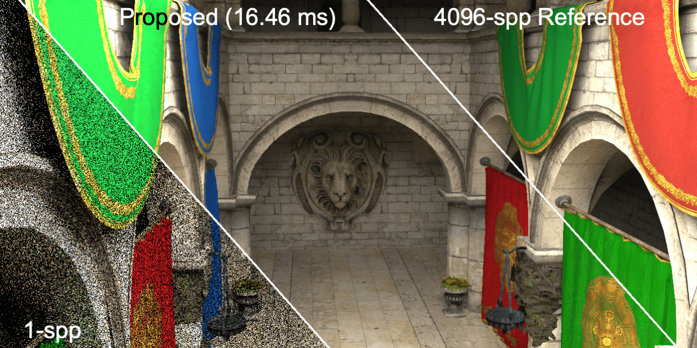

## Real-time Monte Carlo Denoising with the Neural Bilateral Grid
Open source of our EGSR 2020 paper "Real-time Monte Carlo Denoising with the Neural Bilateral Grid"



[**Paper**](https://xiaoxumeng.com/Documents/Meng_EGSR_2020/Real_time_Monte_Carlo_Denoising_with_the_Neural_Bilateral_Grid_EGSR_prepress.pdf)

[**Website**](https://sites.google.com/view/bilateral-grid-denoising)

[**Online Result Viewer (1-spp)**](https://xiaoxumeng.com/Documents/Meng_EGSR_2020/1spp_BMFR_dataset/index.html)
[**Online Result Viewer (64-spp)**](https://xiaoxumeng.com/Documents/Meng_EGSR_2020/64spp_Tungsten_dataset/index.html)

[**Supplementary Material & Dataset**](https://sites.google.com/view/bilateral-grid-denoising/home/supplemental-material-dataset)

\[**Supplementary Video**\] [\[YouTube\]](https://youtu.be/9PVR1-GTt6g)           [\[Bilibili\]](https://www.bilibili.com/video/BV1LZ4y1L7Hp/)

\[**Full Talk Video**\] [\[YouTube\]](https://youtu.be/v633eSb6ygY)               [\[Bilibili\]](https://www.bilibili.com/video/BV14Z4y1L7YW/)

### Introduction
Real-time denoising for Monte Carlo rendering remains a critical challenge with regard to the demanding requirements of both high fidelity and low computation time. In this paper, we propose a novel and practical deep learning approach to robustly denoise Monte Carlo images rendered at sampling rates as low as a single sample per pixel (1-spp). This causes severe noise, and previous techniques strongly compromise final quality to maintain real-time denoising speed. We develop an efficient convolutional neural network architecture to learn to denoise noisy inputs in a data-dependent, bilateral space. Our neural network learns to generate a guide image for first splatting noisy data into the grid, and then slicing it to read out the denoised data. To seamlessly integrate bilateral grids into our trainable denoising pipeline, we leverage a differentiable bilateral grid, called neural bilateral grid, which enables end-to-end training. In addition, we also show how we can further improve denoising quality using a hierarchy of multi-scale bilateral grids. Our experimental results demonstrate that this approach can robustly denoise 1-spp noisy input images at real-time frame rates (a few milliseconds per frame). At such low sampling rates, our approach outperforms state-of-the-art techniques based on kernel prediction networks both in terms of quality and speed, and it leads to significantly improved quality compared to the state-of-the-art feature regression technique.

### Citation
If you find our work useful in your research, please consider citing:
```
  @inproceedings {.20201133,
    booktitle = {Eurographics Symposium on Rendering - DL-only Track},
    editor = {Dachsbacher, Carsten and Pharr, Matt},
    title = {{Real-time Monte Carlo Denoising with the Neural Bilateral Grid}},
    author = {Meng, Xiaoxu and Zheng, Quan and Varshney, Amitabh and Singh, Gurprit and Zwicker, Matthias},
    year = {2020},
    publisher = {The Eurographics Association},
    ISSN = {1727-3463},
    ISBN = {978-3-03868-117-5},
    DOI = {10.2312/sr.20201133}
  }
```
### Prerequisite Installation
(Tested on Ubuntu 16.04 & Ubuntu 18.04)
* Python 3.6
* tensorflow-gpu 1.13.1 + CUDA 10.0
* Pillow 6.1.0 (or newer)
* scikit-image 0.16.1 (or newer)
* OpenEXR 1.3.2 (or newer)

### Test with the Pre-trained Models
1. Clone this repo, and we'll call the directory `${MCDNBG_ROOT}`.
2. Download pre-trained models ["classroom"](https://www.dropbox.com/sh/8o7yijfc6rvba16/AADVi0wNoLrRbSgPBIvgcftsa?dl=0) and put the pretrained model to `${MCDNBG_ROOT}/classroom/model`.
3. Download the [1-spp dataset (19GB)](https://etsin.fairdata.fi/dataset/0ab24b68-4658-4259-9f1d-3150be898c63/data) or the [packed testdata for scene "classroom" (1.4GB)](https://www.dropbox.com/s/i8lqh6ezzeymwr9/bw_data_128x128_1scenes_60ips_50ppi_test.tfrecords?dl=0).
If you are using [1-spp dataset (19GB)](https://etsin.fairdata.fi/dataset/0ab24b68-4658-4259-9f1d-3150be898c63/data), please download the temporal accumulated dataset from [HERE](https://www.dropbox.com/sh/qrf9mwofvy8ikan/AACMvXs_7W2nEk5LpiT1TSHca?dl=0).
4. Recompile the bilateral kernels by running
```
cd bilateral_kernels
./bilateral_kernel.sh
cd ..
```
5. Apply the denoiser by running
```
python network_test.py
```
   - Input
     - If you use the [1-spp dataset (19GB)](https://etsin.fairdata.fi/dataset/0ab24b68-4658-4259-9f1d-3150be898c63/data), please change the data-path in the argument list:
     ```
     python network_test.py -r ${your-data-path}
     ```
     - if you use the [packed testdata for scene "classroom" (1.4GB)](https://www.dropbox.com/s/i8lqh6ezzeymwr9/bw_data_128x128_1scenes_60ips_50ppi_test.tfrecords?dl=0), please put the tfrecords file in `${MCDNBG_ROOT}`.
   - There are a few options in the arguments:
     ```
     --export_exr ## export the exr file of the 1-spp radiance, denoised image, and ground truth
     --export_grid_output ## export the images sliced from the 3 bilateral grids with different resolutions
     --export_guide_weight ## export the guide maps and the weight maps
     --export_grid ## export the CT-scan of the bilateral grids
     ```
6. Evaluate the outputs by running:
```
python evaluation.py -d "classroom"
```
   - The per-frame PSNR, SSIM, RMSE, SMAPE, and relative-MSE are saved in `${MCDNBG_ROOT}/classroom/result/evaluations`
   - The SSIM errormaps and relative-MSE errormaps are saved in `${MCDNBG_ROOT}/classroom/result/evaluations`

### Retrain Your Own Model
Run "python network_train.py"

### Comparison with Multi-Resolution Kernel Prediction Denoiser (MR-KP)
Please visit [our implementation of MR-KP](https://github.com/xmeng525/MultiResolutionKernelPredictionCNN) for more information.
